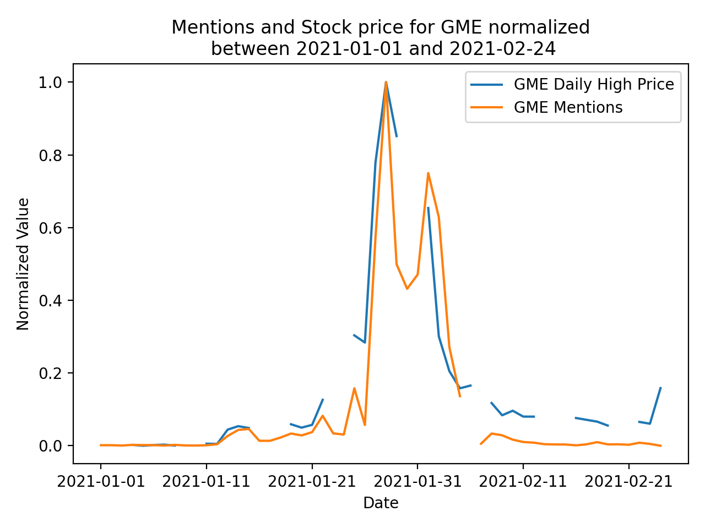
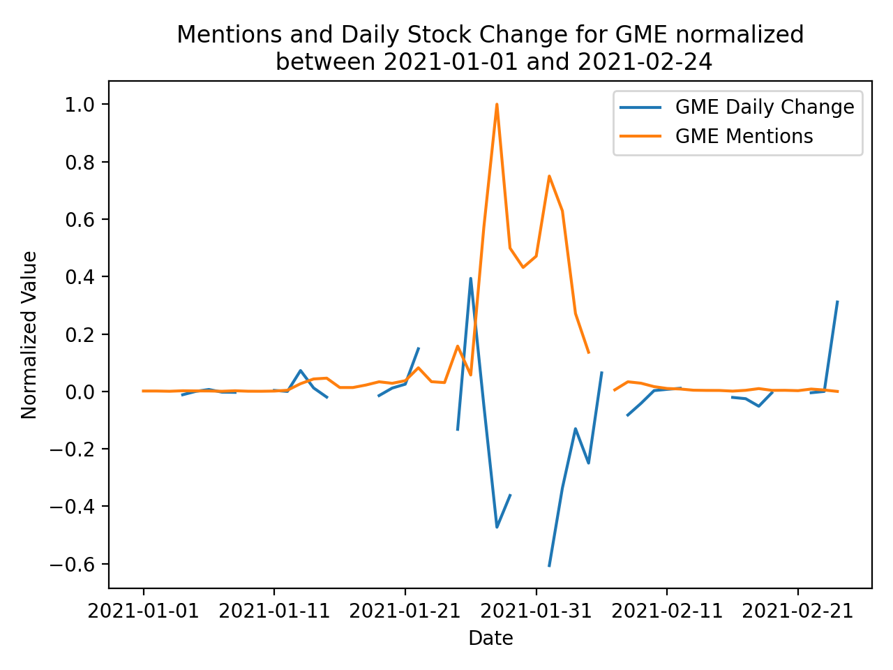

# Analysis of Gamestop Stock in the WallStreetBets Subreddit

## Proposition

WallStreetBets users played a significnat role in the daily price value of GameStop stock during early 2021. WallStreetBets subreddit data will be compared with daily stock price data for 2021. Other "Hype" stocks will be included as well for reference.

## EDA

I initially scraped reddit comment data using the PRAW API. Since this data had minimal structure, it was stored in a MongoDB.
Although each post contained around 50k comments, it was difficult to get statistically significant data from these comments as many times
it would be from a single user/bot spamming. Additionally, on the most interesting posts with 100k+ comments, PRAW API would block me from scraping completely as the request was too large.

I ultimately decided to scrape subreddit posts using the PushShiftAPI. The post titles were more consistent with less concern for user/bot spamming as they were moderated more heavily. Here I scraped The entirety of posts from January 2020 - Present and placed them in a Postgres db. This consisted of 62k rows containing stock_id mentioned, date and post message. I sorted this data by date and stock_id mentioned to get a count of each stock id mentioned per day. I then crosslisted this with scraped stock data in another postgres table. Here I related number of daily mentions of stock to its daily price.

To get this data into acceptable statistic and plotting format, I then took the daily change of mentions and stock price. Finally I normalized both values to be plotted together.

## Hypothesis Testing

H01 = Probability of no significant correlation between WallStreetBets Posts and GameStop stock value
HA1 = Probility of statistically significant correlation between WallStreetBets Posts and GameStop stock Value

H02 = Probability of no significant correlation between GameStop stock value and WallStreetBets subscriber count
HA2 = Probility that Gamestop stock value played a statistically significant roll in increasing WallStreetBets' subscriber count

## Statistical Tests

1.  
    * Null Hypothesis: No correlation between number of stock mentions and GameStop stock price per day
    * Alternate Hypothesis: Statistically significant correlation between stock mentions and GameStop stock price per day

2.  
    * Null Hypothesis: No significant correlation between GameStop stock value and WallStreetBets subscriber count
    * Alternative Hypothesis: Gamestop stock value influenced WallStreetBets subscriber count

## Plots

### GME

By visual inspection, there is a clear connection between GME's high price and the number of mentions
in a given day. The filtered dataset includes frequency of GME ticker symbol recorded on a daily basis. For the 50
days this is plotted over, number of mentions range between 10 to 2800. In this time period, GME intraday high values
range between $19 to $483.

This plot shows the daily number of mentions plotted against the daily change in stock price.
Here, it is seen that on the days when the stock made the largest leaps, whether postive or negative, redditors were
posting the most about the stock. This plot would suggest that people discuss the stock most on days with significant change. This is 
regardless as to whether the stock value is increasing or decreasing.

This scatter plot shows the similarities between change in daily number of mentions and daily stock day change.
After dropping obvious outliers, it is clear that for every change in daily mentions, an expected similar change will occur in GME
stock value.

### AMC

AMC stock was known to have followed a similar trend to GME stock in early 2021. The mentions and stock price follow a near
identical pattern to that of GME.

## Results

###  Running The One Way Anova Test with gradient of daily number of stock mentions, daily change in stock price
1.  **GME**
    *  f value = 1.305
    *  pvalue = 0.257
2.  **AMC**
    *  f value = 1.816
    *  pvalue = 0.181

The resulting p values from the Anova test suggest that there is not a significant enough correlation between stock
price and GME or AMC stock to reject the Null Hypothesis.

###  Running the One Sample Ttest with combined gradient values from daily number of stock mentions, daily change in stock price
1.  **GME**
    *  statistic = -3.999
    *  pvalue = 0.00019
2.  **AMC**
    *  statistic = -3.195
    *  pvalue = 0.0024

The resulting p values from the One Sample Ttest suggest that there is enough statistical signficance to reject the Null Hypothesis that GME price
and mentions on WallStreetBets are correlated.

## Technologies Used
* MongoDB
* PRAW API
* PushShift API
* Docker
* Postgres
* Matplotlib
* Pandas

### Citations:
1.  Hutto, C.J. & Gilbert, E.E. (2014). VADER: A Parsimonious Rule-based Model for Sentiment Analysis of Social Media Text. Eighth International Conference on Weblogs and Social Media (ICWSM-14). Ann Arbor, MI, June 2014
2.  “Yahoo Finance - Stock Market Live, Quotes, Business &amp; Finance News.” Yahoo! Finance, Yahoo!, finance.yahoo.com/.
3.  “Subreddit Stats.” Subreddit Stats - Statistics for Every Subreddit, subredditstats.com/r/wallstreetbets. 
